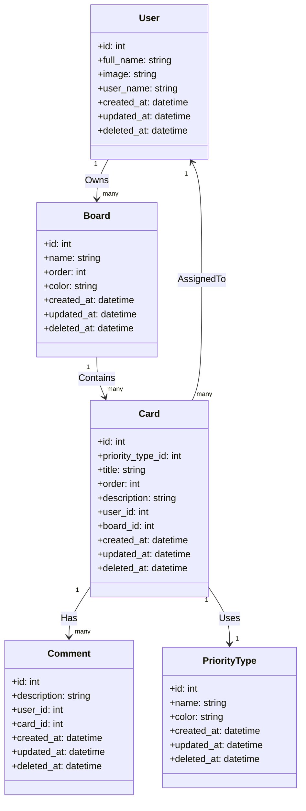

# SETUP LARAVEL / MYSQL

Uma base de aplicação laravel, com Docker, Nginx e Mysql para estudos em PHP Orientado a objetos, com o framework Laravel.

Essa estrutura já está dockerizada, então basta ter o docker compose rodando em seu computador que é pra dar tudo certo.

## Tecnologias

- PHP 8.3
- MySQL
- nginx
- Laravel 11

## Como usar

Passo 0: Instale o projeto via Makefile
`make install`

Alternativamente você pode fazer seguir os outros passos e fazer uma instalação mais manual e personalizada.

Passo 1: Executar o docker
`docker compose up -d`

Passo 2: Entre no container
`docker exec -it setup-laravel_php bash`

Passo 3: E execute o composer install
`composer install`

Passo 4: Crie uma arquivo .env a partir de .env.example
`cp .env.example .env`

Passo 5: Você também precisa gerar a chave da aplicação
`php artisan key:generate`

Passo 6: Aplique as migrações
`php artisan migrate`

Passo 7: Pronto, agora acesse o http://localhost:8080

## Estrutura inicial das classes/tabelas

Ver esquema representativo das [tabelas](https://dbdesigner.page.link/rdiaJVDmpVa2Agvf8)

